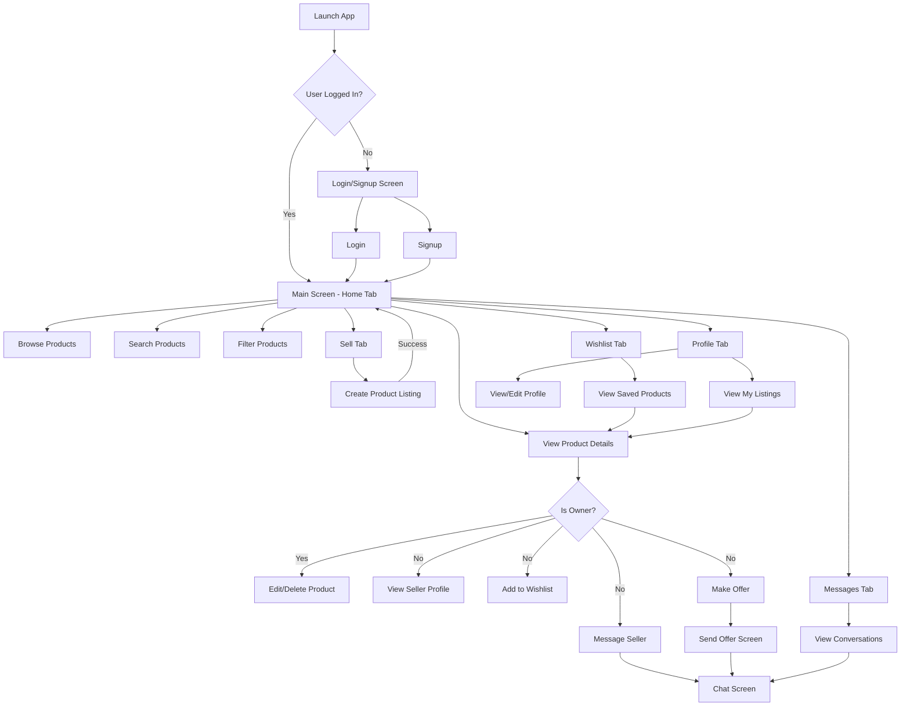

# GoSell

A modern marketplace mobile application that enables users to buy and sell products locally. Built with Kotlin and Jetpack Compose for Android, with Firebase as the backend.

## Table of Contents

- [Overview](#overview)
- [Features](#features)
- [Architecture](#architecture)
- [Flowchart](#flowchart)
- [Wireframes](#wireframes)
- [Technologies Used](#technologies-used)
- [Setup and Installation](#setup-and-installation)
- [Usage](#usage)
- [License](#license)

## Overview

GoSell is a marketplace application developed by Group 18 that connects buyers and sellers in a local community. The app allows users to list products for sale, browse available items, communicate with other users, and manage their personal profiles.

## Features

- **User Authentication**

  - Email/password registration and login
  - User profile with customizable avatar

- **Product Management**

  - Create listings with multiple images
  - Edit and delete your own listings
  - Categories and search functionality
  - Location-based listings

- **Marketplace Experience**

  - Browse available products
  - Filter by category and price
  - View detailed product information
  - Save favorite items to wishlist

- **Communication System**

  - Real-time chat between buyers and sellers
  - Make offers on products
  - Read/unread message tracking

- **Notifications**

  - Get alerts for new messages
  - Receive notifications for offers
  - Track unread message count

- **User Profile**
  - View and edit personal information
  - Upload profile picture
  - Manage listings
  - View wishlist items

## Architecture

GoSell follows the MVVM (Model-View-ViewModel) architecture pattern:

```
├── UI Layer (Compose)
│   ├── Activities
│   ├── Screens
│   └── Components
│
├── ViewModel Layer
│   └── ViewModels for each feature
│
├── Data Layer
│   ├── Models
│   └── Firebase Services
│
└── Utilities
    └── Helper classes
```

### Key Components:

- **Views**: Jetpack Compose UI components organized by feature
- **ViewModels**: Handle UI state and business logic
- **Models**: Data classes representing app entities
- **Firebase Services**: Authentication, Firestore, Storage

## Flowchart



## Wireframes

Below are wireframes for the main screens of the GoSell application:


## Technologies Used

### Frontend/Mobile

- **Kotlin** - Primary programming language
- **Jetpack Compose** - Modern UI toolkit
- **MVVM Architecture** - App architecture pattern
- **Coroutines & Flow** - Asynchronous programming
- **Navigation Components** - For screen navigation

### Backend/Infrastructure

- **Firebase Authentication** - User management
- **Firebase Firestore** - NoSQL database
- **Firebase Storage** - Image storage
- **Spring Boot** - Backend services (previously implemented)

### External Services

- **Cloudinary** - Cloud image management
- **Google Places API** - Location services
- **Google Maps Platform** - Geocoding

## Setup and Installation

1. Clone the repository

```bash
git clone https://github.com/group18/gosell.git
cd gosell
```

2. Open the project in Android Studio

3. Create a Firebase project and add your `google-services.json` file to the app directory

4. Update the following configuration files:

   - `local.properties`: Add your API keys
   - `network_security_config.xml`: Configure network security settings

5. Build and run the application on an emulator or physical device

## Usage

1. Create an account or login with existing credentials
2. Browse products or list your own items for sale
3. Use the chat feature to communicate with other users
4. Make or receive offers on products
5. Manage your listings and profile

## License

Distributed under the MIT License. See `LICENSE` for more information.
